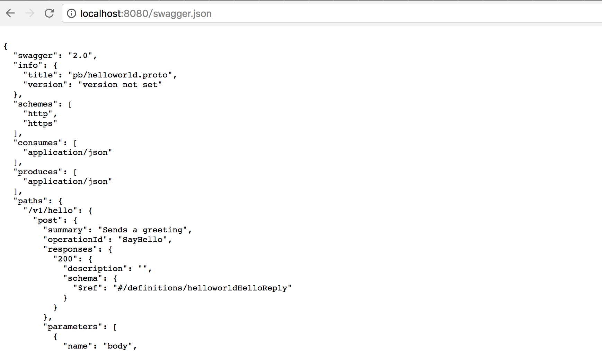
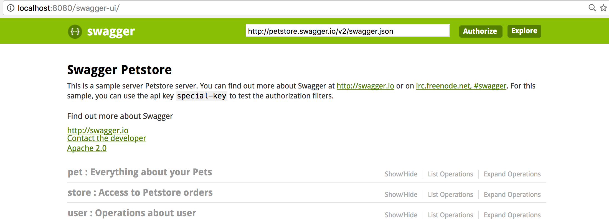
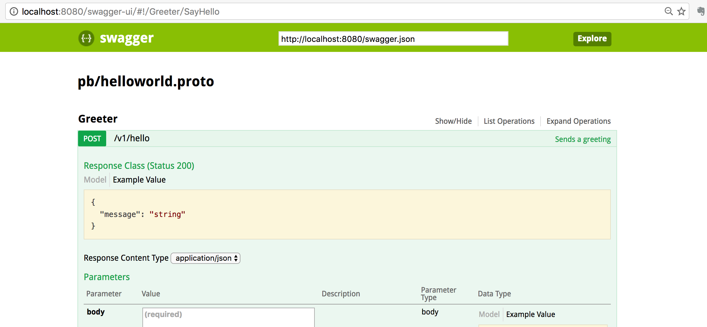

# gRPC helloworld service, restful gateway and swagger

## 概述


## Helloworld gRPC Service

参考 [gRPC Quick Start for Python](http://www.grpc.io/docs/quickstart/python.html)。

### Install gRPC

#### 安装 gRPC

运行命令，

```shell
$ python -m pip install grpcio
```

#### 安装 gRPC 工具箱

Python 的 gRPC 工具箱包括 protol buffer 编译器 protoc 和一些特定插件用于从 .proto 服务定义文件生成 gRPC server 和 client 的代码。

运行命令，

```shell
$ python -m pip install grpcio-tools
```

### 服务定义文件 helloworld.proto

在 pb 目录下新建文件 helloworld.proto，然后在其中使用 [protocol buffers](https://developers.google.com/protocol-buffers/docs/overview) 语法来编写 gRPC 服务定义。文件内容如下：

```protobuf
syntax = "proto3";

package helloworld;

// The greeting service definition.
service Greeter {
    // Sends a greeting
    rpc SayHello (HelloRequest) returns (HelloReply) {}
}
    
// The request message containing the user's name.
message HelloRequest {
    string name = 1;
}
      
// The response message containing the greetings
message HelloReply {
    string message = 1;
}
```

### protoc 编译生成 server 和 client 类定义

使用下面命令来生成 gRPC 的 server 和 client 类定义代码文件，

```shell
$ python -m grpc.tools.protoc -I. --python_out=. --grpc_python_out=. pb/helloworld.proto
```

命令没有报错的话，将会在 pb 目录下生成两个文件 helloworld\_pb2.py 和 helloworld\_pb2\_grpc.py。

其中文件 helloworld\_pb2.py 包含了 HelloRequest 和 HelloReploy 的消息类定义，而文件 helloworld\_pb2\_grpc.py 提供了 gRPC server 类（GreeterServicer）和 client 类（GreeterStub）定义。

### 编写具体的 gRPC 服务类

文件 helloworld\_pb2\_grpc.py 提供了 gRPC server 类（GreeterServicer）提供了 gRPC 服务的规范定义，没有具体的实现。我们需要自己编写 gRPC 服务类文件  server.py，代码如下，

```python
from concurrent import futures
import time

import grpc

import pb.helloworld_pb2 as pb_dot_helloworld__pb2
import pb.helloworld_pb2_grpc as pb_dot_helloworld_pb2__grpc

_ONE_DAY_IN_SECONDS = 60 * 60 * 24

class MyServer(pb_dot_helloworld_pb2__grpc.GreeterServicer):
    def SayHello(self, request, context):
        print("Receive request, request.name: {0}".format(request.name))
        return pb_dot_helloworld__pb2.HelloReply(
            message='Hello, {0}'.format(request.name))

    
def serve():
    server = grpc.server(futures.ThreadPoolExecutor(max_workers=10))
    pb_dot_helloworld_pb2__grpc.add_GreeterServicer_to_server(MyServer(), server)
    server.add_insecure_port('[::]:50051')
    print("GreeterServicer start at port 50051...")
    server.start()
    try:
        while True:
            time.sleep(_ONE_DAY_IN_SECONDS)
    except KeyboardInterrupt:
        server.stop(0)
        
if __name__ == '__main__':
    serve() 
```

然后启动 gRPC server，

```shell
$ python server.py
lienhuadeMacBook-Pro:helloworld_restful_swagger lienhua34$ python server.py 
GreeterServicer start at port 50051...
```

### 编写 gRPC client.py

文件 helloworld\_pb2\_grpc.py 提供了 gRPC client 类（GreeterStub）定义。我们需要编写自己的 client.py 代码来通过 GreeterStub 调用 gRPC server 方法。代码内容如下：
 
```python
import grpc
import pb.helloworld_pb2 as pb_dot_helloworld__pb2
import pb.helloworld_pb2_grpc as pb_dot_helloworld_pb2__grpc

def run():
    channel = grpc.insecure_channel('localhost:50051')
    stub = pb_dot_helloworld_pb2__grpc.GreeterStub(channel)
    response = stub.SayHello(pb_dot_helloworld__pb2.HelloRequest(name="world"))
    print("GreeterService client received: " + response.message)
    
if __name__ == '__main__':
    run() 
```

运行 client.py 代码，

```shell
lienhuadeMacBook-Pro:helloworld_restful_swagger lienhua34$ python client.py 
GreeterService client received: Hello, world
```

至此，可见我们的 gRPC helloworld 服务已经可用。


## RESTful JSON API Gateway

调用 gRPC 服务需要自己编写相对应的 client 代码才行，这无疑给访问 gRPC 带来了一定的难度。我们可以通过在 gRPC 服务上面提供一个 RESTful API gateway，可以直接通过 RESTful JSON API 来访问。

[grpc-gateway](https://github.com/grpc-ecosystem/grpc-gateway) 是 protoc 的一个插件，用于读取 gRPC 服务定义，然后生成一个反向代理服务来将 RESTful JSON API 转换为 gRPC 调用。

### Install grpc-gateway

确保你本地安装了 golang 6.0 以上版本，并且将 $GOPATH/bin 添加到  $PATH 中。然后运行下面命令，
 
```shell
go get -u github.com/grpc-ecosystem/grpc-gateway/protoc-gen-grpc-gateway
go get -u github.com/grpc-ecosystem/grpc-gateway/protoc-gen-swagger
go get -u github.com/golang/protobuf/protoc-gen-go
```

### 修改 helloworld.proto

修改文件 helleworld.proto，添加gateway option，

```protobuf
syntax = "proto3";

package helloworld;

import "google/api/annotations.proto"

// The greeting service definition.
service Greeter {
  // Sends a greeting
  rpc SayHello (HelloRequest) returns (HelloReply) {
    option (google.api.http) = {
      post: "/v1/hello"
      body: "*"
    };
  }
}

// The request message containing the user's name.
message HelloRequest {
  string name = 1;
}

// The response message containing the greetings
message HelloReply {
  string message = 1;
}
```

### 生成 gRPC golang stub 类

运行下面命令生成 gRPC golang stub 类文件，

```shell
$ python -m grpc.tools.protoc -I. \
       -I/usr/local/include \
       -I$GOPATH/src \
       -I$GOPATH/src/github.com/grpc-ecosystem/grpc-gateway/third_party/googleapis \
       --go_out=Mgoogle/api/annotations.proto=github.com/grpc-ecosystem/grpc-gateway/third_party/googleapis/google/api,plugins=grpc:. \
       pb/helloworld.proto
```

此时便在 pb 目录下生成 helloworld.pb.go 文件。

### 生成反向代理代码

运行下面命令生成反向代理代码，

```shell
$ python -m grpc.tools.protoc -I. \
       -I/usr/local/include \
       -I$GOPATH/src \
       -I$GOPATH/src/github.com/grpc-ecosystem/grpc-gateway/third_party/googleapis \
       --grpc-gateway_out=logtostderr=true:. \
       pb/helloworld.proto
```

没有报错的话，将在 pb 目录下生成文件  helloworld.pb.gw.go。

### 编写 entrypoint  文件

编写 entrypoint 文件 proxy.go，内容如下：

```go
package main

import (
	"flag"
	"log"
	"net/http"

	"github.com/grpc-ecosystem/grpc-gateway/runtime"
	"golang.org/x/net/context"
	"google.golang.org/grpc"

	gw "github.com/lienhua34/notes/grpc/helloworld_restful_swagger/pb"
)

var (
	greeterEndpoint = flag.String("helloworld_endpoint", "localhost:50051", "endpoint of Greeter gRPC Service")
)

func run() error {
	ctx := context.Background()
	ctx, cancel := context.WithCancel(ctx)
	defer cancel()

	mux := runtime.NewServeMux()
	opts := []grpc.DialOption{grpc.WithInsecure()}
	err := gw.RegisterGreeterHandlerFromEndpoint(ctx, mux, *greeterEndpoint, opts)
	if err != nil {
		return err
	}

	log.Print("Greeter gRPC Server gateway start at port 8080...")
	http.ListenAndServe(":8080", mux)
	return nil
}

func main() {
	flag.Parse()

	if err := run(); err != nil {
		log.Fatal(err)
	}
}
```

编译，生成可执行文件 helloworld\_restful\_swagger，

```shell
$ go build .
```

### 启动服务

先启动 gRPC 服务，

```shell
lienhuadeMacBook-Pro:helloworld_restful_swagger lienhua34$ python server.py 
GreeterServicer start at port 50051...
```

然后启动 RESTful JSON API gateway，

```shell
lienhuadeMacBook-Pro:helloworld_restful_swagger lienhua34$ ./helloworld_restful_swagger 
2017/01/12 15:59:17 Greeter gRPC Server gateway start at port 8080...
```

通过 curl 进行访问，

```shell
lienhuadeMacBook-Pro:helloworld_restful_swagger lienhua34$ curl -X POST -k http://localhost:8080/v1/hello -d '{"name": "world"}'
{"message":"Hello, world"}
lienhuadeMacBook-Pro:helloworld_restful_swagger lienhua34$ curl -X POST -k http://localhost:8080/v1/hello -d '{"name": "lienhua34"}'
{"message":"Hello, lienhua34"}
```

自此，RESTful JSON API gateway 已经可用了。

## swagger UI

### RESTful JSON API 的 Swagger 说明

通过下面命令可以生成 RESTful JSON API 的 swagger 说明文件。

```shell
$ python -m grpc.tools.protoc -I. \
       -I/usr/local/include \
       -I$GOPATH/src \
       -I$GOPATH/src/github.com/grpc-ecosystem/grpc-gateway/third_party/googleapis \
       --swagger_out=logtostderr=true:. \
       pb/helloworld.proto
```

该命令在 pb 目录下生成一个 helloworld.swagger.json 文件。我们在 pb 目录下直接新增一个文件 helloworld.swagger.go，然后在里面定义一个常量 Swagger，内容即为 helloworld.swagger.json 的内容。

修改 proxy.go 文件中的 run() 方法来添加一个 API 路由来返回 swagger.json 的内容，

```go
func run() error {
	ctx := context.Background()
	ctx, cancel := context.WithCancel(ctx)
	defer cancel()

	mux := http.NewServeMux()
	mux.HandleFunc("/swagger.json", func(w http.ResponseWriter, req *http.Request) {
		io.Copy(w, strings.NewReader(gw.Swagger))
	})

	gwmux := runtime.NewServeMux()
	opts := []grpc.DialOption{grpc.WithInsecure()}
	err := gw.RegisterGreeterHandlerFromEndpoint(ctx, gwmux, *greeterEndpoint, opts)
	if err != nil {
		return err
	}

    log.Print("Greeter gRPC Server gateway start at port 8080...")
	http.ListenAndServe(":8080", mux)
	return nil
}
```

重新编译，并启动 RESTful gateway，然后访问 http://localhost:8080/swagger.json 便得到 helloworld RESTful API 的 swagger 说明了。



但是，swagger.json 内容显示太不直观了。swagger 提供了非常好的可视化 swagger-ui。我们将 swagger-ui 添加到我们的 gateway 中。

### 下载 swagger-ui 代码

[Swagger](https://github.com/swagger-api/swagger-ui) 提供了可视化的 API 说明。我们可以在 RESTful JSON API gateway 中添加 swagger-ui。

将 Swagger 源码的 dist 目录下包含了 swagger ui 所需的 HTML、css 和 js 代码文件，我们将该目录下的所有文件拷贝到 third_party/swagger-ui 目录下。

### 将 swagger-ui 文件制作成 go 内置文件

我们可以使用 [go-bindata](https://github.com/jteeuwen/go-bindata) 将 swagger-ui 的文件制作成 go 内置的数据文件进行访问。

先安装 go-bindata，

```shell
$ go get -u github.com/jteeuwen/go-bindata/...
```

然后将 third-party/swagger-ui 下的所有文件制作成 go 内置数据文件，

```shell
$ go-bindata --nocompress -pkg swagger -o pkg/ui/data/swagger/datafile.go third_party/swagger-ui/...
```

生成文件 pkg/ui/data/swagger/datafile.go，

```shell
$ ls -l pkg/ui/data/swagger/datafile.go 
-rw-r--r--  1 lienhua34  staff  3912436  1 12 22:56 pkg/ui/data/swagger/datafile.go
```

### swagger-ui 文件服务器

使用 go-bindata 将 swagger-ui 制作成 go 内置数据文件之后，我们便可以使用 [elazarl/go-bindata-assetfs](https://github.com/elazarl/go-bindata-assetfs) 结合 net/http 来将 swagger-ui 内置数据文件对外提供服务。

安装 elazarl/go-bindata-assetfs，

```shell
$ go get github.com/elazarl/go-bindata-assetfs/...
```

然后修改 proxy.go 代码，最终代码请看 [proxy.go](https://github.com/lienhua34/notes//grpc/helloworld_restful_swagger/proxy.go)。

重新编译，然后启动 gateway 服务，在浏览器中输入 http://localhost:8080/swagger-ui，



但是上面打开的 swagger-ui 默认打开的是一个 http://petstore.swagger.io/v2/swagger.json 的 API 说明信息。我们需要在输入框中输入我们 API 的地址 http://localhost:8080/swagger.json ，然后点击回车键才能看到我们的 API 说明，



如果我们想让它打开的时候默认就是我们的 API 说明怎么办？将文件 third_party/swagger-ui/index.html 中的 http://petstore.swagger.io/v2/swagger.json 替换成 http://localhost:8080/swagger.json ，然后重新生成 pkg/ui/data/swagger/datafile.go 文件，再重新编译一下即可。

## 参考：

- http://www.grpc.io/blog/coreos
- http://www.grpc.io/docs/quickstart/python.html
- https://github.com/grpc-ecosystem/grpc-gateway
- https://github.com/philips/grpc-gateway-example


